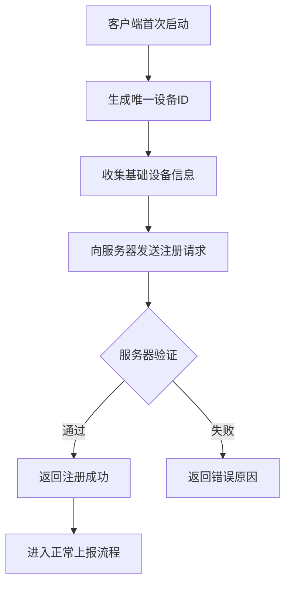
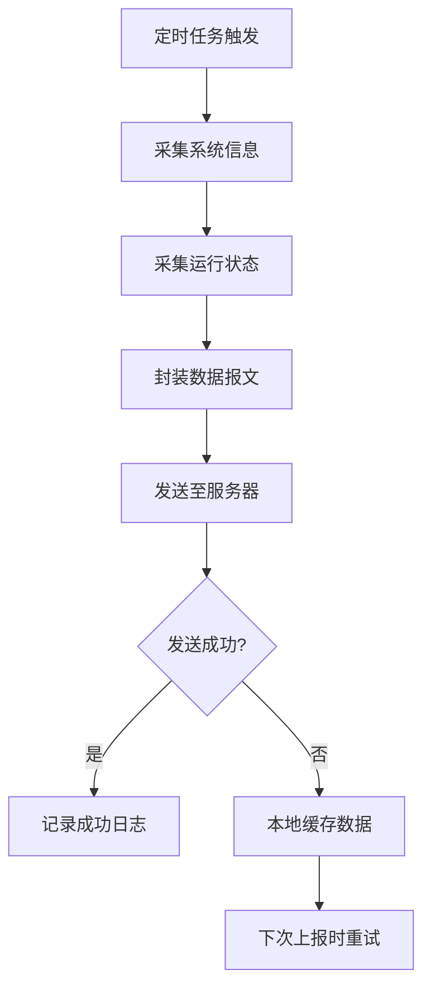
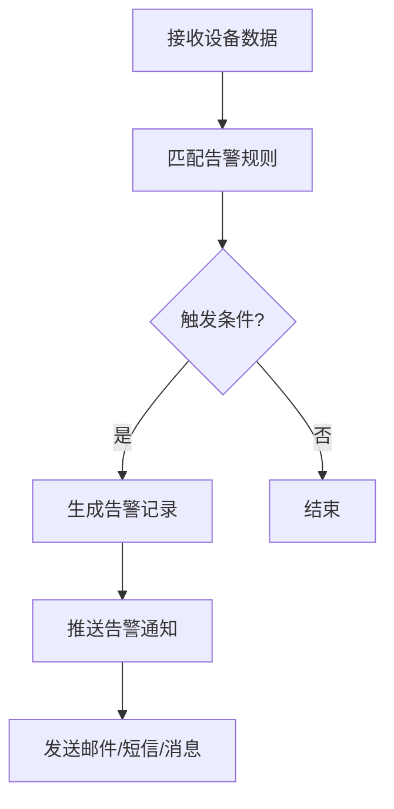
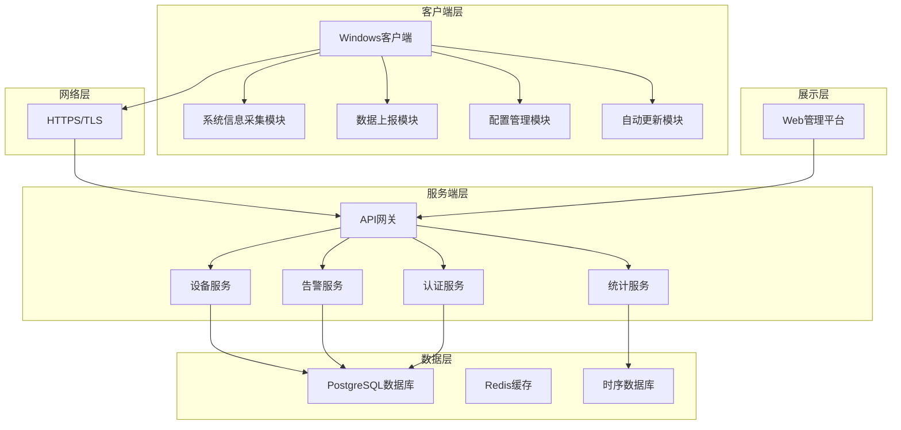

## Windows终端管理系统 - 需求分析文档

### 1. 产品概述
Windows终端管理系统是一款面向企业/团队的设备监控解决方案，通过在每台Windows电脑上部署轻量级客户端程序，自动收集硬件信息、系统状态和运行数据，统一上传至中央服务器进行存储、查询、分析和告警，帮助管理员实时掌握所有终端设备的健康状态。

### 2. 核心功能

#### 2.1 用户角色
| 角色 | 核心权限 |
|------|----------|
| 管理员 | 查看所有终端、设置告警规则、导出报表 |
| 操作员 | 查看授权范围内的终端、处理告警通知 |

#### 2.2 功能模块
1. **客户端程序**：系统信息采集、定时上报、本地配置管理
2. **服务器端**：数据接收存储、设备管理、查询分析、告警系统
3. **Web管理平台**：设备列表、实时监控、历史数据、告警配置

#### 2.3 详细功能说明

**客户端功能**
| 模块 | 功能描述 |
|------|----------|
| 系统信息采集 | 收集CPU、内存、磁盘、网络、USB设备、操作系统版本等硬件信息 |
| 运行状态监控 | 实时监控CPU使用率、内存占用、磁盘空间、网络连接状态 |
| 定时数据上报 | 按配置周期向服务器发送设备数据 |
| 本地配置 | 配置服务器地址、上报间隔、日志级别等参数 |
| 自动更新 | 支持客户端程序自动更新升级 |

**服务器端功能**
| 模块 | 功能描述 |
|------|----------|
| 数据接收服务 | 接收客户端上报的数据，进行校验和存储 |
| 设备管理 | 设备注册、状态跟踪、分组管理 |
| 查询分析 | 设备信息查询、历史数据统计、趋势分析 |
| 告警系统 | 告警规则配置、实时告警触发、告警通知推送 |
| 日志管理 | 操作日志记录、审计追踪 |

**Web管理平台功能**
| 页面 | 模块 | 功能描述 |
|------|------|----------|
| 仪表盘 | 概览统计 | 在线设备数、告警数量、资源使用趋势 |
| 设备列表 | 设备管理 | 设备列表展示、搜索筛选、详情查看 |
| 监控中心 | 实时监控 | CPU/内存/磁盘实时状态图表 |
| 告警管理 | 告警配置 | 告警规则设置、告警记录查询、通知方式配置 |
| 报表中心 | 数据导出 | 设备统计报表、告警统计报表 |

### 3. 核心流程

#### 3.1 设备注册流程

#### 3.2 数据上报流程

#### 3.3 告警触发流程

### 4. 用户界面设计

#### 4.1 设计风格
- 主色调：深蓝色(#1e3a5f)，辅助色：绿色(#28a745)、橙色(#fd7e14)、红色(#dc3545)
- 按钮风格：圆角矩形，hover效果增强
- 字体：微软雅黑/Inter，清晰易读
- 布局：卡片式布局，响应式设计
- 图标：简洁扁平化图标

#### 4.2 页面设计概述
| 页面 | 模块 | UI元素 |
|------|------|--------|
| 仪表盘 | 统计卡片 | 在线设备数、告警数、CPU使用率等指标卡片 |
| 仪表盘 | 趋势图表 | 资源使用趋势折线图 |
| 设备列表 | 表格 | 设备名称、IP、状态、最后上报时间 |
| 设备详情 | 信息面板 | 硬件配置、系统信息、实时状态 |
| 告警管理 | 规则列表 | 规则名称、条件、级别、状态 |
| 告警管理 | 告警列表 | 设备名称、告警类型、时间、处理状态 |

---

## Windows终端管理系统 - 技术方案规划

### 1. 架构设计

### 2. 技术选型

| 层级 | 技术 | 版本 | 说明 |
|------|------|------|------|
| Windows客户端 | C#/.NET | 8.0 | 跨平台支持，性能优异 |
| 服务端框架 | Spring Boot | 3.2.x | 成熟稳定，生态完善 |
| 数据库 | PostgreSQL | 16.x | 关系型数据存储 |
| 时序数据 | InfluxDB | 2.x | 存储时间序列监控数据 |
| 缓存 | Redis | 7.x | 设备状态缓存、限流 |
| Web前端 | React | 18.x | 现代前端框架 |
| UI框架 | Ant Design | 5.x | 企业级UI组件 |
| 图表库 | ECharts | 5.x | 数据可视化 |

### 3. 关键设计

#### 3.1 客户端设计

**技术栈**：C# .NET 8.0 Windows Service

**核心组件**：
- `SystemInfoCollector`: 系统信息采集（CPU、内存、磁盘、网络）
- `DataReporter`: 数据上报（HTTP POST）
- `ConfigManager`: 配置管理（JSON配置文件）
- `AutoUpdater`: 自动更新（差分更新）

**数据采集项**：
| 类别 | 采集项 | 说明 |
|------|--------|------|
| 硬件信息 | CPU型号、核心数 | 系统启动时采集 |
| 硬件信息 | 内存容量 | 系统启动时采集 |
| 硬件信息 | 磁盘容量 | 系统启动时采集 |
| 硬件信息 | 网卡信息 | 系统启动时采集 |
| 硬件信息 | USB设备列表 | 系统启动时采集，定时更新 |
| 系统信息 | OS版本、Build号 | 系统启动时采集 |
| 系统信息 | 主机名、域名 | 系统启动时采集 |
| 运行状态 | CPU使用率 | 定时采集 |
| 运行状态 | 内存使用率 | 定时采集 |
| 运行状态 | 磁盘使用率 | 定时采集 |
| 运行状态 | 网络连接状态 | 定时采集 |

#### 3.2 服务端设计

**模块划分**：
- `device-service`: 设备管理服务
- `monitor-service`: 监控数据处理服务
- `alert-service`: 告警规则引擎服务
- `api-gateway`: API网关

**数据库设计**：

**设备表 (devices)**
| 字段 | 类型 | 说明 |
|------|------|------|
| id | BIGSERIAL | 主键 |
| device_id | VARCHAR(64) | 客户端唯一标识 |
| name | VARCHAR(128) | 设备名称 |
| hostname | VARCHAR(128) | 主机名 |
| os_version | VARCHAR(64) | 操作系统版本 |
| cpu_model | VARCHAR(256) | CPU型号 |
| memory_total | BIGINT | 内存总量(字节) |
| disk_total | BIGINT | 磁盘总量(字节) |
| ip_address | VARCHAR(45) | IP地址 |
| status | VARCHAR(20) | 状态(online/offline) |
| last_report_time | TIMESTAMP | 最后上报时间 |
| created_at | TIMESTAMP | 创建时间 |
| updated_at | TIMESTAMP | 更新时间 |

**告警规则表 (alert_rules)**
| 字段 | 类型 | 说明 |
|------|------|------|
| id | BIGSERIAL | 主键 |
| name | VARCHAR(128) | 规则名称 |
| metric_type | VARCHAR(32) | 指标类型(cpu/memory/disk) |
| operator | VARCHAR(10) | 操作符(> / < / >= / <=) |
| threshold | DECIMAL | 阈值 |
| severity | VARCHAR(20) | 级别(info/warning/critical) |
| enabled | BOOLEAN | 是否启用 |
| notify_channels | TEXT[] | 通知渠道(email/sms/webhook) |
| created_at | TIMESTAMP | 创建时间 |

**告警记录表 (alerts)**
| 字段 | 类型 | 说明 |
|------|------|------|
| id | BIGSERIAL | 主键 |
| device_id | BIGINT | 关联设备ID |
| rule_id | BIGINT | 关联规则ID |
| metric_type | VARCHAR(32) | 指标类型 |
| current_value | DECIMAL | 当前值 |
| threshold | DECIMAL | 阈值 |
| severity | VARCHAR(20) | 级别 |
| status | VARCHAR(20) | 状态(active/resolved) |
| message | TEXT | 告警消息 |
| created_at | TIMESTAMP | 创建时间 |

#### 3.3 API接口设计

**设备管理接口**
| 接口 | 方法 | 说明 |
|------|------|------|
| /api/devices | GET | 获取设备列表 |
| /api/devices/{id} | GET | 获取设备详情 |
| /api/devices/{id} | PUT | 更新设备信息 |
| /api/devices/{id} | DELETE | 删除设备 |

**数据上报接口**
| 接口 | 方法 | 说明 |
|------|------|------|
| /api/report | POST | 客户端数据上报 |
| /api/register | POST | 设备注册 |

**告警管理接口**
| 接口 | 方法 | 说明 |
|------|------|------|
| /api/alerts/rules | GET | 获取告警规则列表 |
| /api/alerts/rules | POST | 创建告警规则 |
| /api/alerts/rules/{id} | PUT | 更新告警规则 |
| /api/alerts/rules/{id} | DELETE | 删除告警规则 |
| /api/alerts | GET | 获取告警记录列表 |
| /api/alerts/{id} | PUT | 更新告警状态 |

**监控数据接口**
| 接口 | 方法 | 说明 |
|------|------|------|
| /api/metrics/{deviceId} | GET | 获取设备历史监控数据 |
| /api/metrics/{deviceId}/realtime | GET | 获取设备实时状态 |

### 4. 部署与集成

#### 4.1 客户端部署
- 安装包：MSI安装程序
- 部署方式：静默安装 `msiexec /i setup.msi /qn`
- 服务注册：Windows Service自启动

#### 4.2 服务端部署
- Docker容器化部署
- Docker Compose编排
- 支持Kubernetes集群部署

#### 4.3 环境配置
| 环境 | 配置说明 |
|------|----------|
| 开发环境 | 本地运行，使用本地数据库 |
| 测试环境 | 独立测试服务器，模拟生产环境 |
| 生产环境 | 高可用集群部署 |

### 5. 安全设计

#### 5.1 数据传输安全
- HTTPS/TLS 1.3加密传输
- API接口认证（API Key + Token）
- 数据完整性校验（MD5/SHA256）

#### 5.2 数据存储安全
- 数据库访问控制
- 敏感数据加密存储
- 定期数据备份

#### 5.3 访问控制
- 基于角色的权限管理（RBAC）
- 操作日志审计
- 会话超时管理

### 6. 性能设计

#### 6.1 客户端性能
- 低资源占用（CPU < 1%, 内存 < 50MB）
- 定时任务优化（避免频繁采集）
- 网络传输压缩（gzip）

#### 6.2 服务端性能
- 异步消息队列处理
- 数据库读写分离
- Redis缓存热点数据
- 水平扩展支持

### 7. 扩展性设计

- 支持多租户部署
- 插件化告警通知方式
- 支持自定义指标采集
- RESTful API易于集成第三方系统

---

## 项目计划

### 里程碑
| 阶段 | 时间 | 目标 |
|------|------|------|
| 第一阶段 | 2周 | 完成客户端核心功能开发 |
| 第二阶段 | 2周 | 完成服务端API开发 |
| 第三阶段 | 2周 | 完成Web管理平台开发 |
| 第四阶段 | 1周 | 测试、文档、上线部署 |

### 交付物
1. Windows客户端安装包
2. 服务端API服务
3. Web管理平台
4. 数据库初始化脚本
5. 部署配置文件
6. 用户手册和API文档